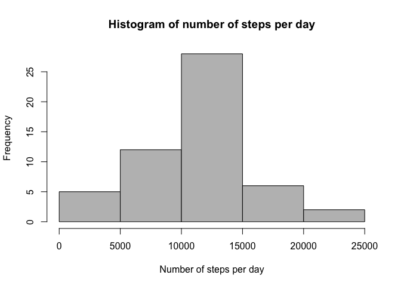
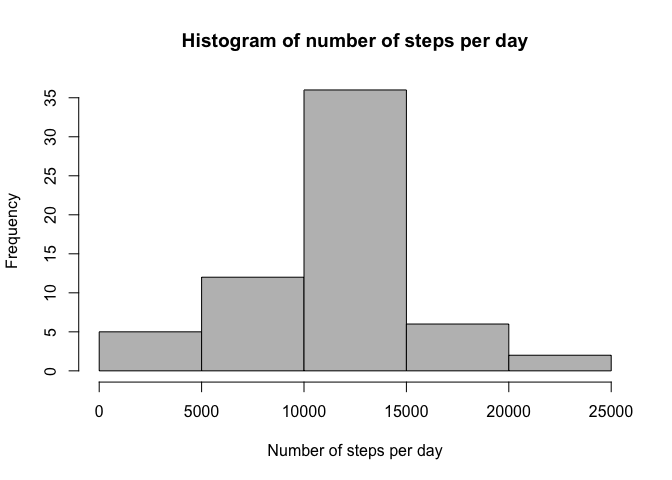
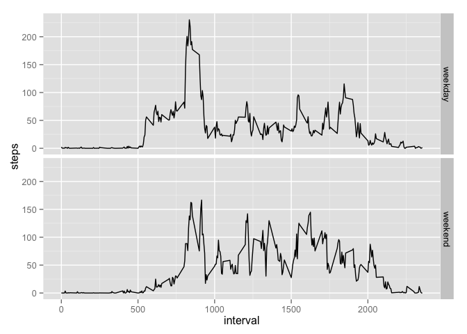

# Reproducible Research: Peer Assessment 1


## Loading and preprocessing the data

We first unzip the data file and read the csv data into a data table.


```r
  unzip('activity.zip')
  data.raw <- read.csv('activity.csv')
```


## What is mean total number of steps taken per day?

First aggregate the total number of steps per day.


```r
  data.per.day <- aggregate(data.raw$steps, by=list(data.raw$date), FUN=sum)
  names(data.per.day) = list('date','steps')
```

We show the number of steps per day in the data in a histogram.


```r
  hist(data.per.day$steps, col='gray', main='Histogram of number of steps per day', xlab='Number of steps per day')
```

 

For the number of steps we can compute the mean and the median.


```r
  mean(data.per.day$steps, na.rm=T)
```

```
## [1] 10766.19
```

```r
  median(data.per.day$steps, na.rm=T)
```

```
## [1] 10765
```

## What is the average daily activity pattern?

First aggregate the averaged number of steps per 5-minute interval taken accross all days.


```r
  data.per.interval <- aggregate(data.raw$steps, by=list(data.raw$interval), FUN=mean, na.rm=T)
  names(data.per.interval) = list('interval','steps')
```

Plot as a times series the averaged number of steps per interval.


```r
  plot(data.per.interval, type='l', ylab='averaged number of steps')
```

 

We can then find the interval which has, on average, the most number of steps.


```r
  data.per.interval[which.max(data.per.interval$steps),1]
```

```
## [1] 835
```

## Imputing missing values

We will start to impute missing values. As a start we evaluate how many missing values, given as NA, are in the dataset.


```r
  # the missing values show up in the TRUE column of the table
  table(is.na(data.raw))
```

```
## 
## FALSE  TRUE 
## 50400  2304
```

We replace the NAs in the raw data frame by the average number of steps over all days in the missing interval. We then
create a new dataset that contains no missing values.


```r
  na.indices <- which(is.na(data.raw$steps))
  
  data.filled <- data.raw
  for(index in na.indices) {
    data.filled$steps[index] <- data.per.interval$steps[data.per.interval$interval==data.raw[index,'interval']]
  }
```

We aggregate again the total number of steps per day, but now with the new complete dataset.


```r
  data.filled.per.day <- aggregate(data.filled$steps, by=list(data.filled$date), FUN=sum)
  names(data.filled.per.day) = list('date','steps')
```

We show the number of steps per day in the data in a histogram.


```r
  hist(data.filled.per.day$steps, col='gray', main='Histogram of number of steps per day', xlab='Number of steps per day')
```

 

For the number of steps we can compute the mean and the median.


```r
  mean(data.filled.per.day$steps)
```

```
## [1] 10766.19
```

```r
  median(data.filled.per.day$steps)
```

```
## [1] 10766.19
```

The influence of imputing the NAs is therefore very minimal.

## Are there differences in activity patterns between weekdays and weekends?

First, we add a factor column indicating whether the day is a weekday or a weekend day.


```r
  wd <- weekdays(as.Date(data.filled$date))
  data.filled$weekday <- ifelse((wd == "Sunday") | (wd == "Saturday"), "weekend", "weekday")
```

We then compute the mean of the number steps grouped by weekday factor and interval.


```r
  data.filled.per.interval <- aggregate(data.filled$steps, by=list(data.filled$interval, data.filled$weekday), FUN=mean, na.rm=T)
  names(data.filled.per.interval) = list('interval','weekday','steps')
```

This allows us to plot the average number of steps per interval for weekdays and weekend days.


```r
  library('ggplot2')
  ggplot(data.filled.per.interval, aes(x=interval, y=steps)) + facet_grid(weekday ~ .) + geom_line()
```

 

